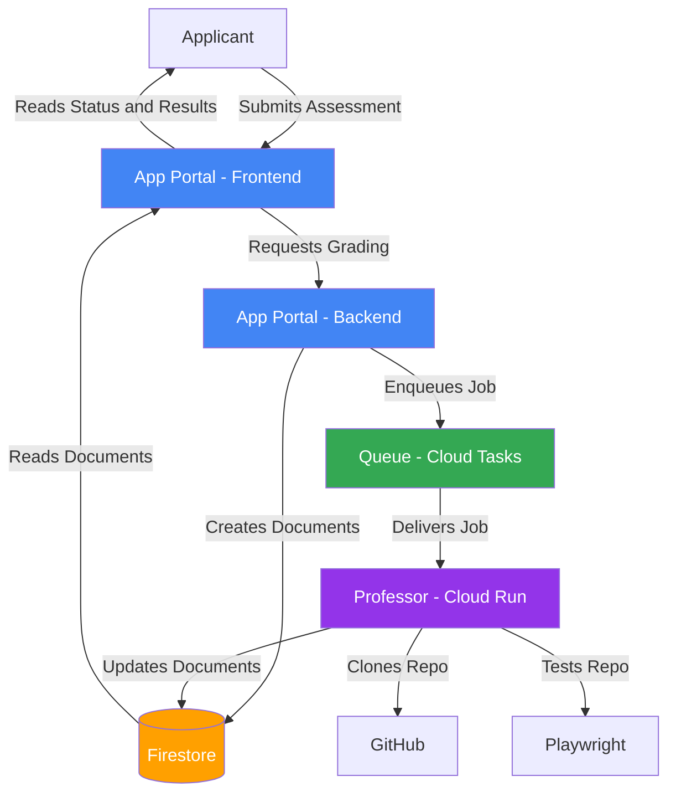

# Professor

Worker for the [Hack4Impact-UMD App Portal](apply.umd.hack4impact.org) assessment autograder.

## Architecture



## Tech Stack

- **Language**: Go
- **Runtime**: Node
- **Package Manager**: Bun
- **Testing**: Playwright
- **Database**: Firestore
- **Deployment**: Docker, Google Cloud Run

## Local Development

Build locally with:

```bash
make build
```

The resulting binary will be `professor`.

With Docker installed and alive, build the image with:

```bash
make docker-build
```

Then run with:

```bash
make docker-run
```

**Make sure you have a .env file in the root directory with `PROJECT_ID` set correctly, and `DEV=true` in order to connect to the firestore emulator**

And now `http://localhost:8000` on your machine should be live!
