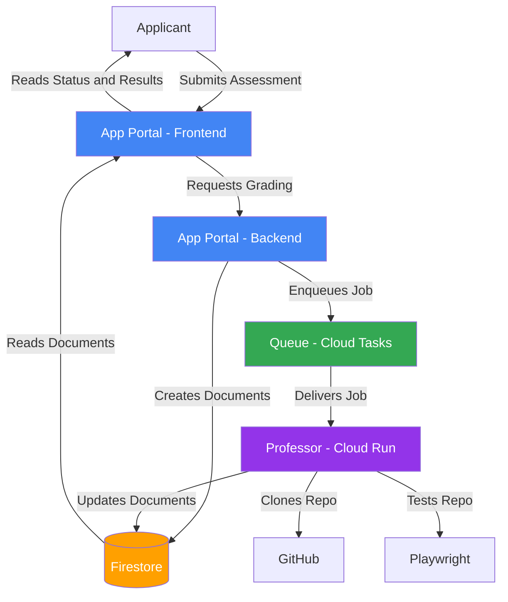

# Professor

Professor is Hack4Impact-UMD's technical assessment autograder. It runs Playwright tests against assessment submissions and reports results to Firestore (when run as a grading worker) or the terminal (when run locally).

Professor is integrated as a grading worker for the [Hack4Impact-UMD Application Portal](apply.umd.hack4impact.org). 

## CLI Usage

```
professor grade <assessment_repo_path> <test_repo_path>
```
Runs Playwright tests against a submission locally and prints results to the terminal.

```
professor serve [--port|-p <port>]
```
Starts the HTTP grading server. Port defaults to `$PORT` or `8000`. Requires Firebase credentials.

## Architecture


```mermaid
graph TB
    User[Applicant] -->|Submits Assessment| Frontend[App Portal - Frontend]
    Frontend[App Portal - Frontend] -->|Reads Status and Results| User[Applicant]
    Frontend -->|Requests Grading| Backend[App Portal - Backend]

    Backend -->|Creates Documents| Firestore[(Firestore)]
    Backend -->|Enqueues Job| CloudTasks[Queue - Cloud Tasks]

    CloudTasks -->|Delivers Job| Professor[Professor - Cloud Run]

    Professor -->|Updates Documents| Firestore
    Professor -->|Clones Repo| GitHub[GitHub]
    Professor -->|Tests Repo| Playwright[Playwright]

    Firestore -->|Reads Documents| Frontend

    style Frontend fill:#4285f4,color:#fff
    style Backend fill:#4285f4,color:#fff
    style Professor fill:#9334e9,color:#fff
    style Firestore fill:#ffa000,color:#fff
    style CloudTasks fill:#34a853,color:#fff
```

## Tech Stack

- **Language**: Go
- **Runtime**: Node
- **Package Manager**: Bun
- **Testing**: Playwright
- **Database**: Firestore
- **Deployment**: Docker, Google Cloud Run

## Local Development

Build locally with:

```bash
make build
```

The resulting binary will be `professor`.

With Docker installed and alive, build the image with:

```bash
make docker-build
```

Then run with:

```bash
make docker-run
```

**Make sure you have a .env file in the root directory with `PROJECT_ID` set correctly, and `DEV=true` in order to connect to the firestore emulator**

And now `http://localhost:8000` on your machine should be live!

